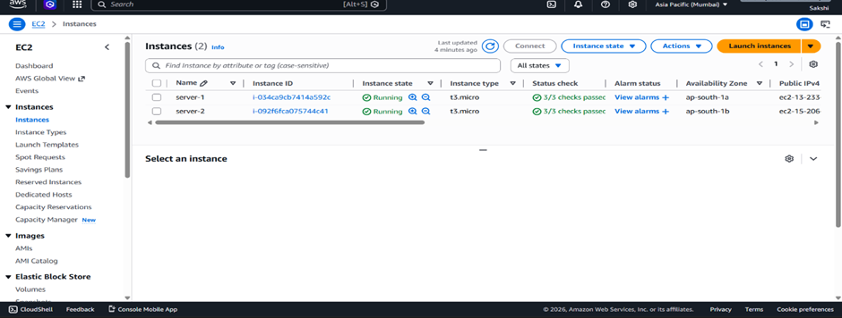
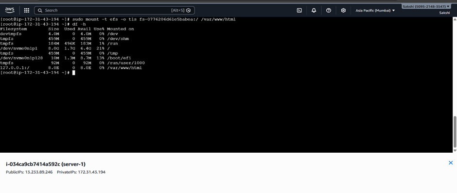
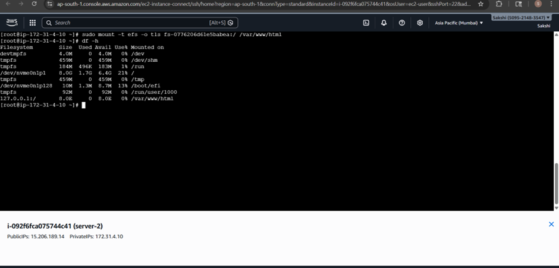

# Project 1: Highly Available Web Application with Shared Storage

## Objective
The objective of this project is to build a scalable web application using multiple EC2 instances with shared storage provided by AWS EFS. This allows all servers to access the same files, ensuring consistency and high availability.

---

## Steps Performed

### 1. Launch EC2 Instances
- Launched 2 Amazon Linux EC2 instances in two different Availability Zones (for high availability).
- Configured public IP for remote access.

### 2. Create and Attach Security Group
- SSH (22) – to access EC2  
- HTTP (80) – for web server  
- NFS (2049) – for EFS mount  
- Attached this security group to both EC2 instances  

### 3. Create EFS File System
- Created an EFS file system in the same VPC  
- Configured mount targets in the Availability Zones  
- Updated EFS security group to allow NFS (2049)  

### 4. Mount EFS on Both EC2 Instances

Install EFS utils:
```bash
sudo yum install -y amazon-efs-utils
```
### 5. Start Web Server
```bash
sudo yum install httpd -y
sudo systemctl start httpd
sudo systemctl enable httpd
sudo systemctl status httpd
```

### 6. Mount EFS
```bash
sudo mount -t efs <EFS-ID>:/ /var/www/html
df -h
cd /var/www/html
vi index.html
```

### AWS Services Used
- EC2 – for web servers
- EFS – shared file system
- Security Groups – SSH, HTTP and NFS configuration

### Configuration Details
| EC2 Instance | Web Server | Mount Point   | Security Group            |
| ------------ | ---------- | ------------- | ------------------------- |
| Instance 1   | Apache     | /var/www/html | SSH 22, HTTP 80, NFS 2049 |
| Instance 2   | Apache     | /var/www/html | SSH 22, HTTP 80, NFS 2049 |

### Challenges Faced
- After installing Apache, I forgot to start the service.
- Because of this, the webpage was not loading.
#### Resolved by running:
- sudo systemctl start httpd
- sudo systemctl enable httpd

### Output / Result
- The web application is accessible from both EC2 instances.
- Files uploaded from one instance are visible on the other.

### Learning Summary
- Learned how to configure EFS for shared storage.
- Understood high availability using multiple EC2 instances.

## Screenshots

### 1. EC2 Instances Created
This shows two EC2 instances running in different Availability Zones.



---

### 2. EFS Mounted on Server 1


### 2. EFS Mounted on Server 2


### 4. Web Application Running on Server 1
Application accessed from EC2 Instance 1.


### 5. Web Application Running on Server 2
Same application accessed from EC2 Instance 2.


