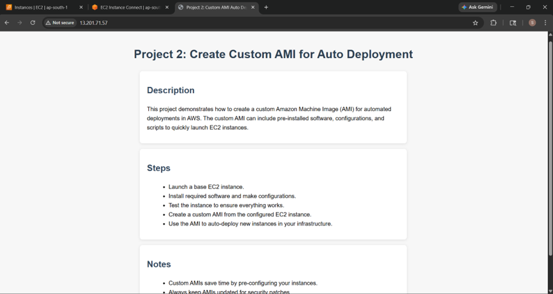
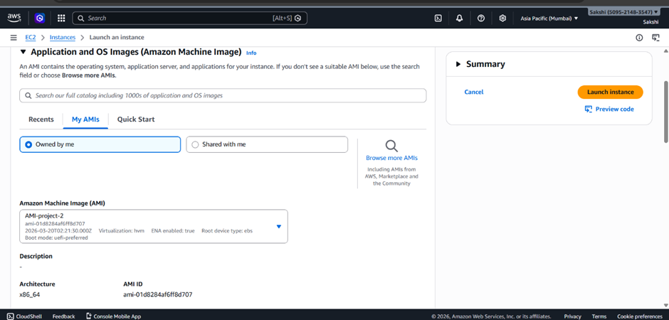
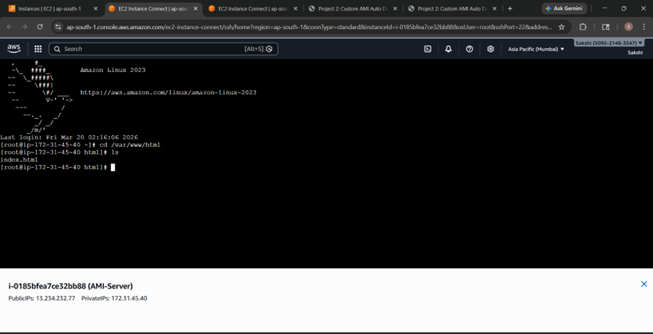
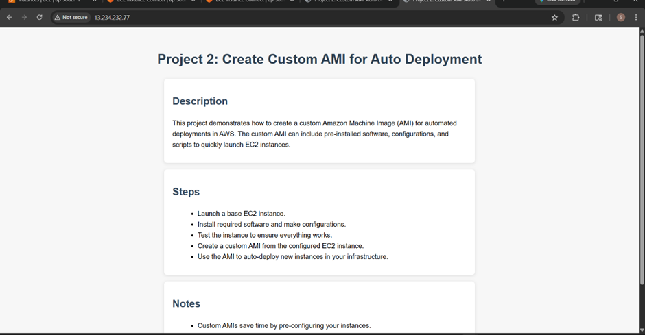

# Project 2: Create Custom AMI for Auto Deployment

## Objective
The aim of this project is to learn how to create a custom Amazon Machine Image (AMI). This is useful because once we have a pre-configured server, we can quickly launch new servers without setting everything up manually.


## Steps Performed

### 1. Launch an EC2 Instance
- Launched an Amazon Linux EC2 instance  
- Configured security group to allow:
  - SSH (22)
  - HTTP (80)


### 2. Install Web Server and Sample App
- Connected to the instance using SSH  

Install Apache:
```markdown

sudo yum update -y
sudo yum install -y httpd
sudo systemctl start httpd
sudo systemctl enable httpd
```

- Create a sample webpage:

`sudo vi /var/www/html/index.html`
- Verified the webpage using the EC2 public IP in browser

### 3. Create Custom AMI
- Selected EC2 instance → Actions → Image → Create Image
- Named it as WebServer-AMI
- Clicked Create Image
- Waited until AMI is available

### 4. Launch New EC2 from AMI
- Launched a new EC2 instance using the created AMI
- The instance already had Apache and the webpage
- Verified by opening public IP → webpage displayed

### AWS Services Used
- EC2 – for server instances
- AMI – for reusable images
- Security Groups – for SSH and HTTP

### Outcome / Result
- New EC2 instance had pre-installed web server and application
- No need for manual setup
- Faster deployment achieved

### Learning Summary
- Learned how to create and use custom AMI
- Understood importance of automation in deployment
- Gained practical experience with EC2 and AMI


## Screenshots

### 1. Web Application Running (Original Instance)
This shows the web application running on the initial EC2 instance after installing Apache.




### 2. AMI Created and Visible
This shows the custom AMI created and visible under "My AMIs" while launching a new instance.



### 3. New EC2 Instance from AMI
This shows the new EC2 instance created from the custom AMI and connected successfully.




### 4. Web Application Running (New Instance)
This shows the web application running on the new EC2 instance created from the AMI.



