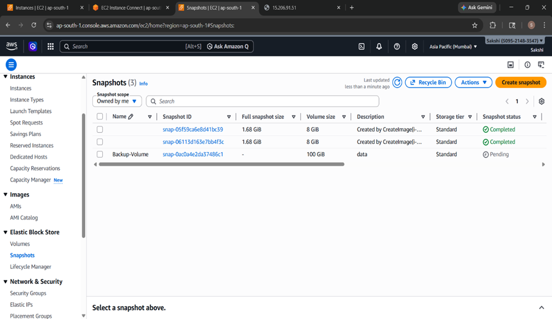
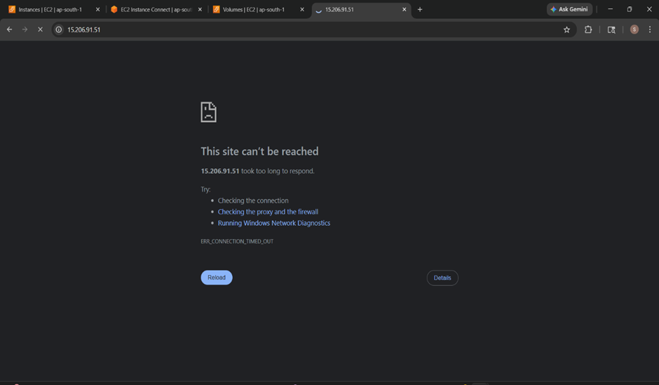
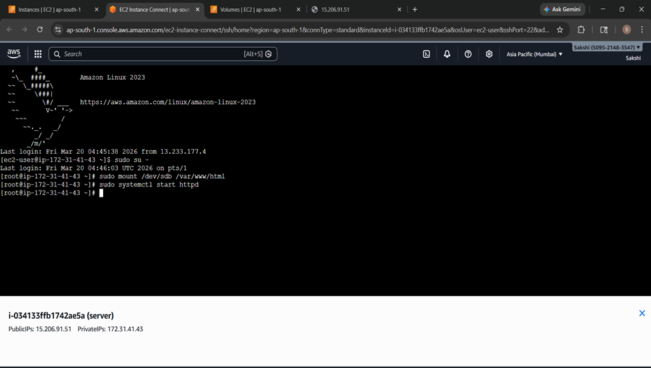
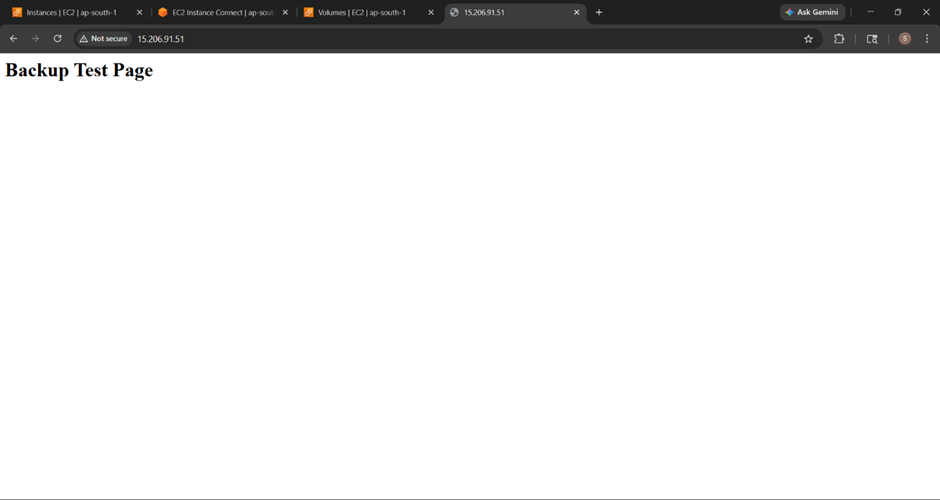

# Project 3: Backup & Disaster Recovery Strategy

## Objective
The main aim of this project is to understand how backup and recovery works in AWS using EBS snapshots. This helps in restoring data if something goes wrong like volume failure or accidental deletion.

---

## Steps Performed

### 1. Launch EC2 and Attach EBS Volume
- Launched a new Amazon Linux EC2 instance  
- Attached a new EBS volume to the instance  

---

### 2. Format and Mount the Volume

- Format the volume:
```bash
sudo mkfs -t ext4 /dev/sdb
```
- Create directory and mount:

```bash
sudo mkdir /var/www/html
sudo mount /dev/sdb /var/www/html
```
### 3. Store Sample Data
```bash
echo "<h1>Backup Test Page</h1>" | sudo tee /var/www/html/index.html
```
- Verified that the file is present and accessible

### 4. Create Snapshot
Went to AWS Console → EC2 → Volumes
Selected the EBS volume → Clicked Create Snapshot
Gave a name and created the snapshot

### 5. Simulate Failure (Delete Volume)
```bash
sudo systemctl stop httpd
sudo umount /var/www/html
```
- Detached and deleted the EBS volume
- Verified that the data/webpage is no longer accessible

### 6. Restore Volume from Snapshot
- Went to Snapshots → Created new volume from snapshot
- Attached the new volume to EC2

### 7. Mount Restored Volume and Verify
```python
sudo mount /dev/sdb /var/www/html
sudo systemctl start httpd

```
- Check data:
```bash
cat /var/www/html/index.html
```
- Verified in browser that the webpage is restored

### AWS Services Used
- EC2
- EBS (Elastic Block Store)
- Snapshots
- Security Groups

### Challenges Faced
- After deleting the volume, the webpage was still showing due to caching or default Apache page.
- Resolved by stopping Apache and unmounting the volume before deleting it.
- Faced confusion while mounting directly to /var/www/html, but fixed it by properly creating and mounting the volume.

### Outcome / Result
- Successfully created backup using snapshot
- Simulated failure by deleting volume
- Restored volume and recovered data
- Verified application works after recovery

### Learning Summary
- Learned how to take EBS snapshots
- Understood backup and recovery process
- Gained hands-on experience in disaster recovery

## Screenshots

### 1. Sample Webpage Running (Before Backup)
This shows the application running after creating sample data using:
```bash
echo "<h1>Backup Test Page</h1>" | sudo tee /var/www/html/index.html 
```


### 2. Snapshot Creation (Pending State)

This shows the snapshot being created from the EBS volume named "backup volume". The status is in pending state.





### 3. After Volume Deletion (Failure Simulation)

After deleting the EBS volume, the application is no longer accessible and shows "This site can’t be reached".





### 4. Restored Volume Mounted on New EC2

New EC2 instance is launched and volume is restored and mounted:





### 5. Webpage Restored After Recovery

This shows the application working again after restoring the volume from snapshot.



