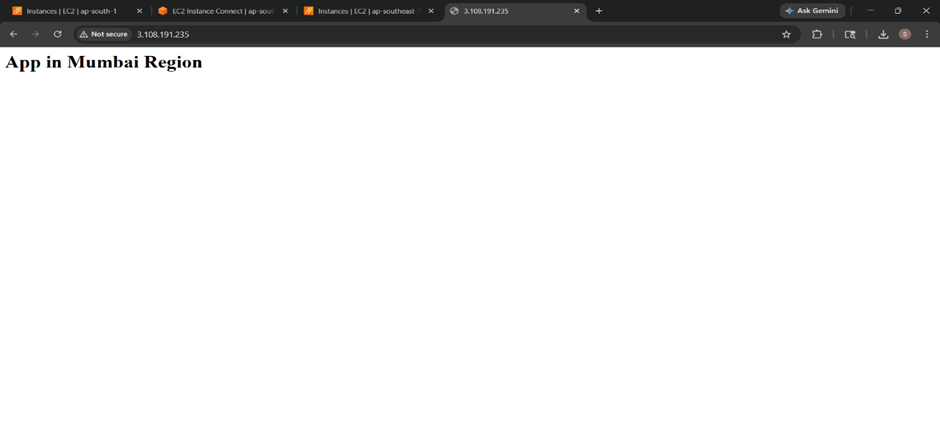
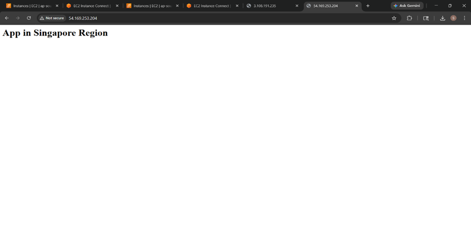
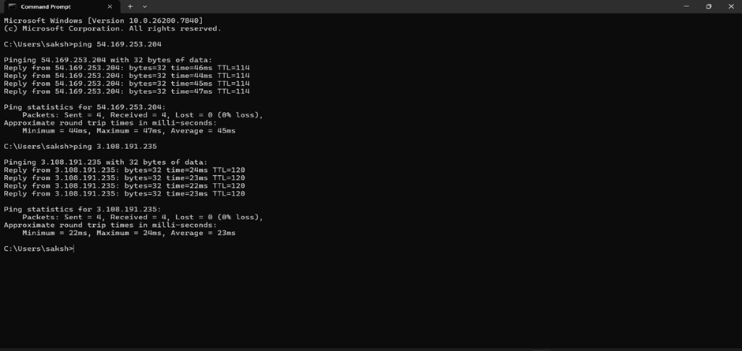
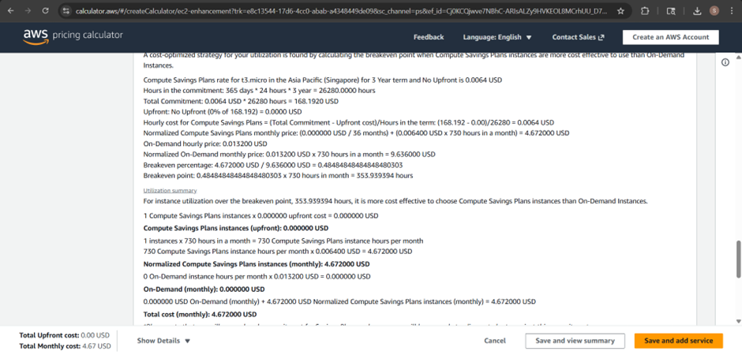

# Project 4: Multi-Region Architecture Simulation

## Objective
The main aim of this project is to understand how AWS works across different regions and how applications can be deployed in multiple locations for better availability and performance.

---

## Steps Performed

### 1. Launch EC2 in Mumbai Region
- Selected region as **Mumbai (ap-south-1)**  
- Launched an Amazon Linux EC2 instance  
- Configured security group:
  - SSH (22)
  - HTTP (80)

---

### 2. Install Web Server and Deploy Application

```bash
sudo yum update -y
sudo yum install -y httpd
sudo systemctl start httpd
sudo systemctl enable httpd
```
- Create webpage:
```bash
echo "<h1>App in Mumbai Region</h1>" | sudo tee /var/www/html/index.html
```
- Verified using public IP

### 3. Launch EC2 in Singapore Region
- Switched region to Singapore (ap-southeast-1)
- Launched another EC2 instance
- Installed Apache and created webpage:
```bash
echo "<h1>App in Singapore Region</h1>" | sudo tee /var/www/html/index.html
```
- Verified using Singapore public IP

### 4. Compare Latency
- Initially, ping was not working due to ICMP blocked in security group
- Allowed ICMP (All IPv4) in security group
- Then executed:
```bash
ping <Mumbai-EC2-Public-IP>
ping <Singapore-EC2-Public-IP>
```
- Observed Mumbai has lower latency compared to Singapore
- Reason: Mumbai is geographically closer

### 5. Compare Cost
- Used AWS Pricing Calculator
- Selected same instance type (t3.micro)
- Observed slight cost difference between regions

### AWS Services Used
- EC2
- Security Groups
- AWS Pricing Calculator

### Challenges Faced
- Ping command was not working initially due to ICMP blocked
- Fixed by allowing ICMP in security group
- Faced confusion while switching regions in AWS Console initially

### Outcome / Result
- Successfully deployed application in two regions
- Verified both applications are working independently
- Compared latency and cost differences

### Learning Summary
- Learned about AWS regions and availability
- Understood multi-region deployment
- Learned how latency depends on location
- Got idea about cost differences

## Screenshots

### 1. Mumbai Region Web Application




### 2. Singapore Region Web Application




### 3. Ping Result (Latency)




### 5. Pricing Comparison



